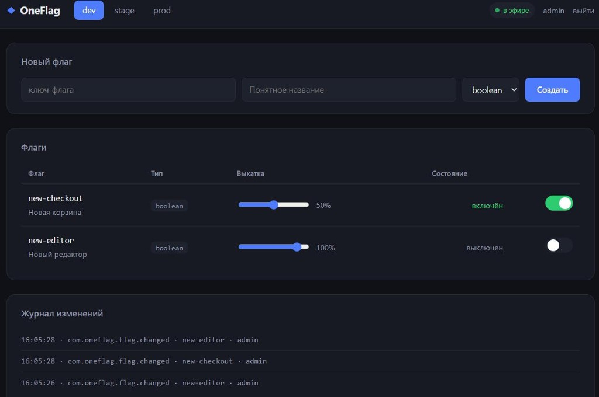
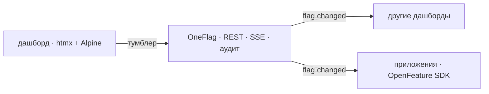

# OneFlag

[](https://openyellow.org/grid?filter=top&repo=1323974055)
[](https://t.me/wonder_yellow)
[](https://deepwiki.com/yellow-hammer/oneflag)

Self-hosted сервис управления фича-флагами и remote-config на чистом OneScript. Аналог Unleash и Flagsmith для команд, которым нужно решение внутри закрытого контура и на родном стеке.



Главное свойство: **изменение флага доходит до приложений мгновенно**. Оператор щёлкает тумблер в дашборде - подключённые приложения меняют поведение в ту же секунду, без перезапуска и без опроса сервера.



## Быстрый старт

```
docker compose up --build
```

Дашборд: <http://localhost:3333>, логин `admin`, пароль `admin`.

Чтобы увидеть живое обновление своими глазами, поднимите стенд вместе с демонстрационным приложением:

```
docker compose --profile demo up --build
docker compose logs -f demo-client
```

Приложение печатает, что показало бы пользователю. Создайте в дашборде флаг `new-checkout`, включите его, поставьте выкатку 50% - вывод меняется сам:

```
[19:38:35] user-1: старая корзина (disabled) | user-42: старая корзина (disabled)
[19:38:43] user-1: новая корзина (static)    | user-42: новая корзина (static)
[19:38:49] user-1: новая корзина (split)     | user-42: старая корзина (split)
[19:38:55] user-1: старая корзина (disabled) | user-42: старая корзина (disabled)
```

Обратите внимание на строку со `split`: при выкатке 50% часть пользователей получает новую корзину, часть - старую, и это распределение стабильно. Один и тот же пользователь не будет «мигать» между вариантами, а при увеличении процента никто не выключится обратно.

### Запуск без Docker

```
opm install oneflag
oneflag serve
```

Доступные команды:

| Команда | Назначение |
|---|---|
| `oneflag serve` | Запуск сервера с дашбордом и API |
| `oneflag flags [окружение]` | Список флагов окружения, без запуска сервера |
| `oneflag help` | Справка |

Из исходников:

```
opm install --dev
cp .env.example .env
oscript src/main.os serve
```

## Возможности

| Что | Как сделано |
|---|---|
| Мгновенная доставка изменений | Server-Sent Events, один поток на дашборды и SDK |
| Совместимость со стандартом | Клиенты работают через [OpenFeature](https://openfeature.dev) |
| Окружения | dev / stage / prod, у каждого своя настройка флага |
| Таргетинг | Правила «атрибут → оператор → значение» с вариантами |
| Процентные выкатки | Стабильное распределение через MurmurHash3 |
| Мультивариантные флаги | boolean, string, number, object |
| Аудит | Журнал изменений в формате CloudEvents 1.0 |
| Вход и доступ | JWT в httpOnly-куке для дашборда, ключ для SDK |
| Ошибки API | RFC 9457 (`application/problem+json`) |
| Наблюдаемость | `/healthz` и `/metrics` в формате Prometheus |
| Дашборд | htmx + Alpine, без сборщика JS |

## Дашборд

- переключение флага одним щелчком, ответ приходит фрагментом строки таблицы;
- ползунок процентной выкатки;
- переключатель окружений;
- журнал изменений, который наполняется в реальном времени;
- индикатор состояния потока: видно, что соединение живое.

Все действия дашборда идут через htmx: страница не перезагружается, а сервер отвечает готовым куском разметки. Сборщик JS не нужен, внешняя сеть тоже - библиотеки отдаются с самого сервиса.

## API

### Управление флагами

| Метод и путь | Назначение |
|---|---|
| `GET /api/flags?env=dev` | Список флагов окружения |
| `POST /api/flags` | Создать флаг |
| `GET /api/flags/{key}` | Один флаг со всеми окружениями |
| `PATCH /api/flags/{key}?env=dev` | Изменить настройку в окружении |
| `DELETE /api/flags/{key}` | Удалить флаг |
| `GET /api/environments` | Список окружений |
| `GET /api/audit?limit=50` | Журнал изменений |

```bash
curl -X POST http://localhost:3333/api/flags \
  -H "Authorization: Bearer local-sdk-key" \
  -H "Content-Type: application/json" \
  -d '{"ключ":"new-checkout","имя":"Новая корзина","тип":"boolean"}'

curl -X PATCH "http://localhost:3333/api/flags/new-checkout?env=prod" \
  -H "Authorization: Bearer local-sdk-key" \
  -H "Content-Type: application/json" \
  -d '{"включен":true,"процентВыкатки":25}'
```

### Оценка флагов

| Метод и путь | Назначение |
|---|---|
| `POST /api/evaluate` | Оценить один флаг |
| `POST /api/evaluate/all` | Оценить все флаги окружения |
| `GET /api/snapshot?env=dev` | Снимок конфигурации для локальной оценки |
| `GET /stream` | Поток изменений (SSE) |

```bash
curl -X POST http://localhost:3333/api/evaluate \
  -H "Authorization: Bearer local-sdk-key" \
  -H "Content-Type: application/json" \
  -d '{"flagKey":"new-checkout","environment":"prod","context":{"targetingKey":"user-42","plan":"pro"}}'
```

```json
{"flagKey":"new-checkout","value":true,"variant":"вкл","reason":"TARGETING_MATCH","errorCode":""}
```

## Клиентский SDK

Приложение работает через стандартный API OpenFeature, поэтому не привязано к OneFlag: провайдера можно заменить, не трогая прикладной код.

```bsl
#Использовать openfeature
#Использовать oneflag-sdk

OpenFeature.УстановитьПровайдер(
    Новый OneFlagProvider("http://localhost:3333", "local-sdk-key", "prod"));

Клиент = OpenFeature.ПолучитьКлиента();
Контекст = Новый EvaluationContext("user-42", Новый Структура("plan", "pro"));

Если Клиент.ПолучитьЛогическое("new-checkout", Ложь, Контекст) Тогда
    ПоказатьНовуюКорзину();
КонецЕсли;
```

Провайдер устроен так же, как SDK зрелых систем управления флагами:

1. при инициализации забирает снимок конфигурации одним запросом;
2. дальше вычисляет значения **локально** - оценка флага не стоит сетевого вызова;
3. в фоновом задании слушает поток изменений и обновляет снимок;
4. при недоступном сервере не падает: клиент OpenFeature отдаёт значения по умолчанию.

Правила разрешения вынесены в класс `FlagEvaluator`, который используют и сервер, и SDK. Значение флага не может разойтись между тем, что показывает дашборд, и тем, что видит приложение.

## Модель флага

```json
{
  "ключ": "new-checkout",
  "тип": "boolean",
  "варианты": { "вкл": true, "выкл": false },
  "настройки": {
    "prod": {
      "включен": true,
      "вариантПоУмолчанию": "вкл",
      "процентВыкатки": 25,
      "правила": [
        { "атрибут": "plan", "оператор": "равно", "значения": ["pro"], "вариант": "вкл" }
      ]
    }
  }
}
```

Порядок разрешения значения:

1. флаг выключен в окружении → значение по умолчанию, причина `DISABLED`;
2. сработало правило таргетинга → вариант правила, причина `TARGETING_MATCH`;
3. задана процентная выкатка → вариант либо значение по умолчанию, причина `SPLIT`;
4. иначе вариант по умолчанию, причина `STATIC`.

Операторы правил: `равно`, `не равно`, `содержит`, `начинается с`, `заканчивается на`, `больше`, `меньше`, `версия равна`, `версия больше`, `версия меньше`, `версия в диапазоне`.

Операторы версий сравнивают значения по [semver](https://semver.org): `1.10.0` новее `1.9.0`, а `2.0.0-beta` предшествует `2.0.0`. Числовые `больше` и `меньше` для версий не годятся - `1.10.0` числом не разбирается. Диапазон принимает форму `>=1.2.0`, `^1.2.3`, `~1.2`, `1.2.x` и составную `>=1.0.0 <2.0.0`. Значение, которое версией не является, правило не выбирает:

```json
{ "атрибут": "appVersion", "оператор": "версия в диапазоне", "значения": [">=2.1.0"], "вариант": "вкл" }
```

## Конфигурация

Параметры читаются из переменных окружения, а при локальном запуске - из файла `.env` (см. `.env.example`). Приоритет у переменных окружения.

| Переменная | По умолчанию | Назначение |
|---|---|---|
| `ONEFLAG_PORT` | `3333` | Порт HTTP-сервера |
| `ONEFLAG_STORAGE_KIND` | `sqlite` | Вид хранилища: sqlite, postgresql, json, memory |
| `ONEFLAG_STORAGE` | `data/oneflag.db` | Строка соединения или путь |
| `ONEFLAG_SECRET` | - | Секрет подписи токенов, **обязательно замените** |
| `ONEFLAG_ADMIN_LOGIN` / `ONEFLAG_ADMIN_PASSWORD` | `admin` / `admin` | Учётные данные дашборда |
| `ONEFLAG_SDK_KEY` | `local-sdk-key` | Ключ доступа для SDK |
| `ONEFLAG_ENVIRONMENTS` | `dev,stage,prod` | Список окружений |
| `ONEFLAG_DEFAULT_ENVIRONMENT` | `dev` | Окружение по умолчанию |
| `ONEFLAG_AUDIT_LIMIT` | `500` | Сколько записей аудита хранить |
| `ONEFLAG_TOKEN_TTL` | `28800` | Срок жизни токена входа, секунды |

## Хранение

Данные хранятся через ORM [entity](https://github.com/oscript-library/entity), поэтому выбор СУБД сводится к настройке,
а прикладной код от него не зависит.

| `ONEFLAG_STORAGE_KIND` | `ONEFLAG_STORAGE` | Когда подходит |
|---|---|---|
| `sqlite` (по умолчанию) | путь к файлу базы | Одиночная установка: транзакции и индексы без внешнего сервера |
| `postgresql` | строка соединения | Команда, несколько экземпляров сервиса, резервное копирование средствами СУБД |
| `json` | каталог с таблицами | Когда конфигурацию хотят читать глазами и держать в системе контроля версий |
| `memory` | произвольная метка | Тесты и разовые прогоны |

Схема создаётся при первом обращении, отдельный шаг миграции не нужен.

### Модель данных

| Сущность | Таблица | Содержимое |
|---|---|---|
| `FeatureFlag` | `Флаги` | Ключ, имя, описание, тип, варианты |
| `FlagEnvironment` | `Окружения` | Ключ, имя, порядок отображения |
| `FlagSetting` | `НастройкиФлагов` | Настройка флага в окружении: включён, вариант, процент, правила |
| `FlagAuditRecord` | `Аудит` | Событие CloudEvents целиком плюс колонки для отбора |

Варианты флага и правила таргетинга хранятся строками JSON. Они всегда читаются и пишутся вместе со своей сущностью,
поиска по отдельному правилу нет, а состав у каждого флага свой, поэтому раскладывать их по таблицам значило бы
усложнить схему без выгоды.

В Docker база вынесена в том `oneflag-data`, поэтому флаги переживают пересоздание контейнера.

## Наблюдаемость

`GET /metrics` отдаёт метрики в формате Prometheus. Эндпоинт не написан здесь: он встроен из пакета
[prometheus-metrics](https://github.com/yellow-hammer/prometheus-metrics) командой `prometheus-metrics embed ./app`,
а сервис только регистрирует свои метрики в реестре [prometheus](https://github.com/yellow-hammer/prometheus).

| Метрика | Тип | Смысл |
|---|---|---|
| `oneflag_flags` | gauge | Флагов в хранилище |
| `oneflag_environments` | gauge | Окружений |
| `oneflag_stream_subscribers` | gauge | Открытых подписок на поток изменений |
| `oneflag_audit_records` | gauge | Записей в журнале аудита |
| `oneflag_flag_changes_total` | counter | Изменения флагов, лейблы `environment` и `event` |
| `oneflag_flag_evaluations_total` | counter | Оценки флагов, лейблы `environment` и `reason` |

Показатели состояния считаются в момент сбора, а не хранятся копией: расхождение с хранилищем было бы
незаметным и вводило бы в заблуждение. Если хранилище недоступно, они отдают `-1` - значение, отличимое
от честного нуля. Счётчик оценок разложен по причинам решения, поэтому по нему видно, чем вызвано значение
флага: правилом таргетинга, процентной выкаткой или откатом к умолчанию.

Логи пишутся через [logos](https://github.com/oscript-library/logos), уровни настраиваются в
`autumn-properties.json`. По умолчанию в журнал попадают старт хранилища, входы в дашборд, изменения флагов
и неудачные попытки входа.

## Дашборд

Разметка лежит в `src/templates` и собирается шаблонизатором JinjOS через
[winow-view](https://github.com/yellow-hammer/winow-view). Значения экранируются прямо в шаблоне вызовами
`View.ЭкранироватьHtml` и `View.ЭкранироватьАтрибут`: в тексте и в значении атрибута правила разные, и в шаблоне
видно, какое применено.

htmx и Alpine.js отдаются по `/vendor/...` из того же `winow-view` - он же единственное место, где записаны
их версии. Своих копий этих файлов сервис не держит: иначе обновление htmx пришлось бы помнить в двух местах.
Отдаёт их контроллер, а не каталог статики, потому что путь к статике пакета известен только в рантайме,
а winow читает каталоги из настроек до старта прикладного кода. Внешняя сеть при этом не нужна - дашборд
работает в закрытом контуре.

Контроллеры лежат в `app`, а не в `src/Controls`, потому что заготовка winow читает каталог контроллеров
раньше, чем autumn применяет `autumn-properties.json`, и всегда получает значение по умолчанию `./app`.

Клиентский SDK вынесен в отдельный проект [oneflag-sdk](https://github.com/yellow-hammer/oneflag-sdk):
приложениям нужен только он, без сервера.

## Ограничения

- **HTTPS не поддерживается**: платформа не даёт TLS поверх `TCPСоединение`. Для внешнего доступа поставьте обратный прокси.
- Роли пока сведены к одному администратору дашборда и одному ключу SDK; полноценный RBAC с несколькими пользователями не реализован.
- Вебхуки наружу не реализованы, хотя события уже формируются в формате CloudEvents и готовы к доставке.
- SQLite рассчитан на один узел. Для нескольких экземпляров сервиса нужен `postgresql`: тогда общее состояние держит СУБД, но живое обновление по SSE работает только для клиентов того экземпляра, который принял изменение.

## Лицензия

[MIT](LICENSE)

